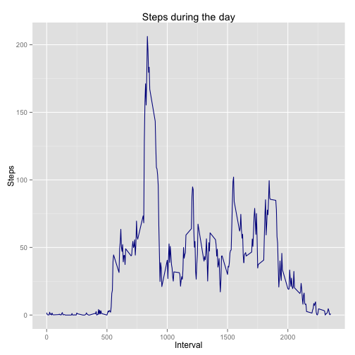

# Reproducible Research: Peer Assessment 1

This is a peer assessment for Coursera's course: 
[Reproductive Research](https://class.coursera.org/repdata-010). 
For more information, please got to the Coursera pages
or read the README.md file that is located in the same repository.

**Author**: Tomasz Domanski

**Date**: 18-01-2015

## Dataset

The dataset for this assesment is already present in this repository in 
`activity.zip` file but if you need to redownload it please use this [link](
https://d396qusza40orc.cloudfront.net/repdata%2Fdata%2Factivity.zip).

This dataset is an output from the activity monitoring device, that was counting
number of steps taken during the day. This set contains two months of data in 
CSV format with three variables:

 * **steps** - number of steps taken in given interval
 * **date** - date of measurement in format: YYYY-MM-DD
 * **interval** - the device is saving results every 5 minutes and **interval**
 variable contains the information about the time when the steps were recorded.
 Format of this variable is HHmm but with no leading zeroes (i.e. 35 min past 
 midnight would be represented as '35' and 13:55 will be saved as '1355')
)

## Libraries
Libraries needed for code snippets to work:


```r
library("data.table")
library("ggplot2")
library("stringr")
library("lubridate")
```

## Loading and preprocessing the data
As noted in previous section, we assume that our set is already present in 
'activity.zip' file, but if it's not the case, please download it and save
as 'activity.zip' or just run:

```
download.file(
    "https://d396qusza40orc.cloudfront.net/repdata%2Fdata%2Factivity.zip", 
    destfile="activity.zip",
    method="curl")
```

Dataset is zipped so we start with unzipping it, then we read it and save to 
**data** variable.


```r
if( !file.exists("activity.csv") ){
    unzip("activity.zip")
}

data <- fread("activity.csv")
```

We need to translate this odd format of representing time into standard 
time format, so we will be able to represent the data better. We do it by
adding the leading zeroes and reading date with time


```r
intervals <- data$interval
intervals_hours <- str_pad(intervals, 4, pad="0")
int_time <- strptime(paste(data$date, intervals_hours, sep=" "), format="%Y-%m-%d %H%M")
```


## What is mean total number of steps taken per day?

For a start we will see the histogram of the steps taken each day.
We start with preparing summary by day.


```r
summary <- data[, sum(steps), by=date]
setnames(summary, c("date", "steps"))
```

And this is a histogram for the computed data.


```r
mean_plot <- ggplot( summary , aes(x=steps) ) 
mean_plot <- mean_plot + geom_histogram(binwidth = 800, aes(fill = ..count..))
mean_plot <- mean_plot + xlab("Day") + ylab("Steps")
mean_plot <- mean_plot + ggtitle("Steps per day")
mean_plot <- mean_plot + geom_rug(sides="b")
mean_plot
```

 

Because we would like to compute mean only on existing values, we have to filter
out the NA values. After all NA values are filtered we will compute sum
of steps with grouping by date and we will compute the mean.


```r
clean_data <- data[!is.na(data$steps), ]
summary_data <- clean_data[, sum(steps), by=date]
setnames(summary_data, c("date", "steps"))
mean_steps_daily <- mean(summary_data$steps)
median_steps_daily <- median(summary_data$steps)
```


The mean number of steps daily is 10766.19 and
the median is 10765.00

## What is the average daily activity pattern?
We would like to see how average day looks like. We will prepare histogram
that will show average number of steps taken during the day.


```r
steps_by_interval <- data[,mean(steps, na.rm=TRUE),by=interval]
setnames(steps_by_interval, c("interval", "steps"))
```

And we plot the results


```r
avg_steps <- ggplot(steps_by_interval, aes(x=interval, y=steps)
    ) + geom_line(colour="darkblue"
    ) + ggtitle("Steps during the day"
    ) + xlab("Interval") + ylab("Steps")
avg_steps
```

 

Now we will search where is the peak during the day.


```r
max_steps <- max(steps_by_interval$steps)
inter <- steps_by_interval[steps_by_interval$steps == max_steps][1, interval]
```

The maximum number of steps is 206.17 and it occurs
in 835 interval

## Imputing missing values

Only variable **steps** contains missing values so to compute how many missing
values we have to just count NA values in **steps** column


```r
missing_values_count <- sum(is.na(data$steps))
```
And the result is: 2304 missing values.

To fill the missing values in the table we will use avg values computed previously.
We will round the values so they will be more realistic.


```r
setnames(steps_by_interval, c("interval", "avg_steps"))
merged <- merge(data, steps_by_interval, by="interval")
merged$steps[is.na(merged$steps)] <- round(merged$avg_steps[is.na(merged$steps)])
merged[,avg_steps:=NULL]
```

```
##        interval steps       date
##     1:        0     2 2012-10-01
##     2:        0     0 2012-10-02
##     3:        0     0 2012-10-03
##     4:        0    47 2012-10-04
##     5:        0     0 2012-10-05
##    ---                          
## 17564:     2355     0 2012-11-26
## 17565:     2355     0 2012-11-27
## 17566:     2355     0 2012-11-28
## 17567:     2355     0 2012-11-29
## 17568:     2355     1 2012-11-30
```

We will prepare new summary table that will contain last changes.


```r
summary_total_steps <- merged[,sum(steps),by=date]
setnames(summary_total_steps, c("date", "steps"))
```

And we will see it on histogram:


```r
new_summary <- ggplot(summary_total_steps, aes(x=steps) 
    ) + geom_histogram(binwidth = 1000, aes(fill = ..count..)
    ) + xlab("Total steps per day") + ylab("Steps"
    ) + ggtitle("Steps per day") + geom_rug(sides="b")
new_summary
```

 

We will check what is the change in mean and median value.


```r
new_mean_steps_daily <- mean(summary_total_steps$steps)
new_median_steps_daily <- median(summary_total_steps$steps)
```

And the new mean number of steps daily is 10765.64 and
the median is 10762.00

## Are there differences in activity patterns between weekdays and weekends?
To distinguish week days from weekends we will prepare data with this code


```r
merged$date = ymd(merged$date)
merged[weekdays(date) %in% c("Saturday", "Sunday"), day_type := 'weekend']
```

```
##        interval steps       date day_type
##     1:        0     2 2012-10-01       NA
##     2:        0     0 2012-10-02       NA
##     3:        0     0 2012-10-03       NA
##     4:        0    47 2012-10-04       NA
##     5:        0     0 2012-10-05       NA
##    ---                                   
## 17564:     2355     0 2012-11-26       NA
## 17565:     2355     0 2012-11-27       NA
## 17566:     2355     0 2012-11-28       NA
## 17567:     2355     0 2012-11-29       NA
## 17568:     2355     1 2012-11-30       NA
```

```r
merged[!weekdays(date) %in% c("Saturday", "Sunday"), day_type := 'weekday']
```

```
##        interval steps       date day_type
##     1:        0     2 2012-10-01  weekday
##     2:        0     0 2012-10-02  weekday
##     3:        0     0 2012-10-03  weekday
##     4:        0    47 2012-10-04  weekday
##     5:        0     0 2012-10-05  weekday
##    ---                                   
## 17564:     2355     0 2012-11-26  weekday
## 17565:     2355     0 2012-11-27  weekday
## 17566:     2355     0 2012-11-28  weekday
## 17567:     2355     0 2012-11-29  weekday
## 17568:     2355     1 2012-11-30  weekday
```
And we create new table:


```r
day_type_mean <- merged[,mean(steps), by=c("day_type", "interval")]
setnames(day_type_mean, c("day_type", "interval", "avg_steps"))
```

The best method to compare weekends with week days is to show them on one plot:


```r
plot_by_day_type <- ggplot(day_type_mean, aes(x=interval, y=avg_steps)
    ) + geom_line(colour="darkblue") + facet_grid(day_type ~ .
    ) + ggtitle("Comparsion of activities in weekday and weekend"
    ) + xlab("Intervals") + ylab("Avarage Steps")
plot_by_day_type
```

 


